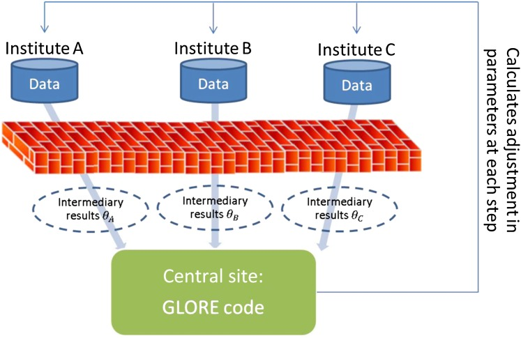

## About GLORE
* Grid binary LOgistic REgression (GLORE)
* GLORE is a distributed (collaborative / federated) algorithm to build a logistic regression model using horizontally partitioned datasets across multiple sites without sharing individual-level data
* Input is the horizontally partitioned datasets scattered in multiple sites
* Output is the fitted logistic regression model with estimated coefficients, standard error along with the model performance diagnostic scores (AUC for model discrimination and Hosmer Lemeshow test results for model calibration)
* Reference: Wu et al. JAMIA 2012 [PMID: 22511014](https://pubmed.ncbi.nlm.nih.gov/22511014/)




**Figure 2** of [Wu et al. 2012.](https://pubmed.ncbi.nlm.nih.gov/22511014/) Pipeline for the Grid Binary LOgistic REgression (GLORE) model. Data sets hosted in different institutions (ie, A, B, and C) are processed locally through the same virtual engine (ie, GLORE code) to compute non-sensitive intermediary results, which are exchanged and combined to obtain the final global model parameters at the central site. A similar distributed process is executed for evaluation of the model.

## What is required in a client-side computer
You can think of GLORE JAVA client as an FTP-client program connecting to the FTP-server with predetermined IP address and port number. No prior knowledge of client IP address or port number is required. The client computer should have following requirements ready:
* Can connect to the server (IP address 54.187.74.36 and port 2828)
* Installed with Java version 11.0.8 or higher, [openjdk](https://openjdk.java.net/)
* Installed with GLORE [client code](GLORE_client/)
* Uploaded **non-sharable** input file 


## Server 
```bash
sudo docker run -d --name=glore_v03 -p8888:8888 -p2828:2828 winstonli96/glore:ver03
```
where glore_v03  is the container name and 8888 is the port of Jupyter notebook you want to expose. The port to which clients can connect is the openly accessible 2828. The server administrator can then access the Jupyter notebook from within the VPN as follows:
```bash
  http://server:8888
  pwd123
```

1. The hub site will start the “manager” docker
2. All other sites will start the “worker” docker or JAVA client
3. Each site will put the individual-level dataset with no PHI information in a directory of the host machine (external to Docker or JAVE client) and bind this directory to the local Docker instance during instance initiation
4. No individual data will go out of the firewall, they stay in the local site
5. Only aggregate data (coefficient, standard error, and variance-covariance) at variable level, typically included in tables/figures of journal publication, will be shared with other sites

## Client (Terminal based)
1. Prepare a server
2. Install JRE via command line
```bash
apt-get install openjdk-11-jre  # the command may be different depending on the OS
java -version
    # openjdk 11.0.8 2020-07-14  We tested on 11.0.7 and 11.0.8, other jrd-11 also shall work)
```
3. Create a folder with full access right, eg: glore_client
```bash
mkdir glore_client
```
4. Download/copy [the client installation file](https://drive.google.com/file/d/1SRL642QXzgFpp64HUwfpXfy6FwlfPm_S/view?usp=sharing) to the folder <glore_client>
```bash
cd glore_client
tar -xzvf client.tar.gz    # to unzip the code
```
5. Start the client
```bash
./client.sh test_part3.csv   # where test_part3.csv is input file
````

## Example of input file (not shared, stays behind the firewall)

The individual with age over 89 are discarded from the input file to meet the non-HIPAA criteria. No personal indentifiers will be included.
Example of what the **non-sharable** input file will contain:

| OUTCOME | AGE_years | SEX_male | RACE_asian | RACE_black |
| --------|-----------|----------| ---------- |------------|
|   0     | 0.33      |   1      |      0     |     0      |
|   1     | 0.64      |   0      |      1     |     0      |
|   0     | 0.47      |   1      |      0     |     0      |
|   1     | 0.55      |   0      |      0     |     1      |


## Example of intermediate/final files (shared with a server)

Example of what the sharable intermediate file called variance-covariance matrtix will contain:

|             | AGE_years   | SEX_male   | RACE_asian   | RACE_black   |
| ------------|-------------|------------| ------------ |--------------|
| AGE_years   |   0.041440  | -0.026973  |   0.001584   | -0.002364    |
| SEX_male    |  -0.026973  |  0.000573  |   0.003064   |  0.000552    |
| RACE_asian  |   0.001584  |  0.003064  |   0.281068   |  0.000712    |
| RACE_black  |  -0.002364  |  0.001584  |   0.000712   |  0.014535    |

Example of what the sharable output file will contain:

| Variable        | Coefficient | Std. Error | Z-value   | P-value |
| ----------------|-------------|------------| --------- |---------|
|   Intercept     |  -7.6533    | 0.0997     |  -76.7381 |    0    |
|   AGE_years     |   4.2962    | 0.1151     |  37.3217  |    0    |
|   SEX_male	  |   1.2965    | 0.0370     |	34.9967  |    0    |
|   RACE_asian    |  -0.2019    | 0.0832     |	-2.4579  | 0.0139  |
|   RACE_black    |  -0.4611    | 0.0612     |	-7.5371  |    0    |


## How to prepare GLORE input data for R2D2 project
Run the [template SQL](sql/template_query.sql) to create a non-PHI individual level input data for GLORE.


